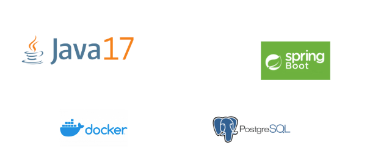

# Fila de Triagem de Especialidades

Sistema responsável pelo controle de fila de triagem para especialidades. O objetivo do sistema

Url de acesso: http://localhost:8080/api/v1

## Stack

- Java 17
- Spring Boot
- Docker
- PostGres



## Iniciar testes unitários

Execução dos testes unitários. Necessário ter o utilitário make instalado.

```shell
make api/test
```

## Iniciar ambiente dev/local

Inicia container e configura a aplicação. Necessário ter o utilitário make instalado.

```shell
make dev/local
```

ou inicialização manual

```shell
docker-compose up -d
mvnw spring-boot:run
```

## GIT
https://github.com/cleitonmelo/specialty-screening.git


## Collection para importação no Postman


## Documentação API

### Formulário de Triagem

- [Criar um Formulário de Triagem](docs/screening/create.md)
- [Associar um Formulário a um especialista](docs/screening/update.md)
- [Visualizar um Formulário de Triagem](docs/screening/show.md)
- [Listar Formulários Cadastrados](docs/screening/list.md)
- [Finalizar com um diagnóstico](docs/screening/finalize.md)

### Especialidades

- [Criar uma Especialidade](docs/specialty/create.md)
- [Visualizar uma Especialidade](docs/specialty/show.md)
- [Listar Especialidades](docs/specialty/list.md)
- [Atualizar uma Especialidade](docs/specialty/update.md)

### Especialistas

- [Criar um Especialista](docs/specialists/create.md)
- [Visualizar um Especialista](docs/specialists/show.md)
- [Listar Especialistas](docs/specialists/list.md)
- [Atualizar um Especialista](docs/specialists/update.md)

### Lista de Enums

- [Status de Diagnósticos](docs/enums/diagnosis.md)

## Swagger
http://localhost:8080/swagger-ui/index.html